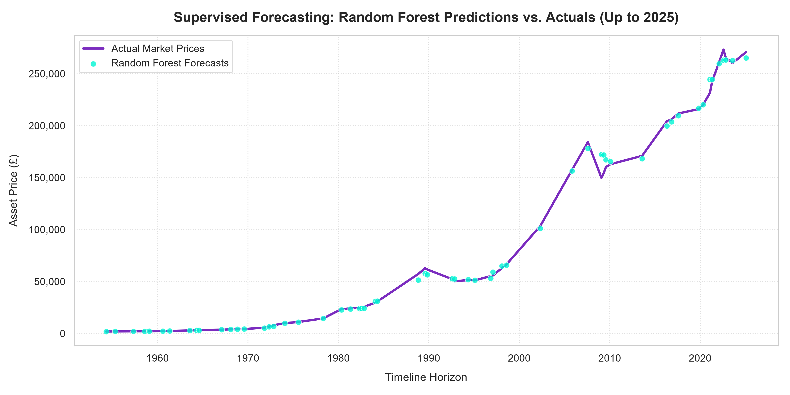
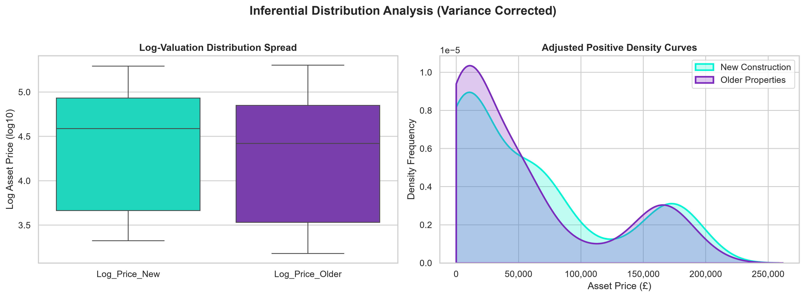

# 🏡 Real Estate Market Analytics & Predictive Engine

An end-to-end cloud ingestion and supervised machine learning forecasting pipeline that programmatically consumes historical property indices from a live web endpoint, conducts rigorous inferential hypothesis testing to analyze market premiums, and leverages ensemble **Random Forest Regression** to forecast macro house prices up to May 2025.

---

## 🔮 Predictive Forecasting Performance
Our primary ensemble forecasting model maps future evaluations across the modern 72-year timeline horizon with extraordinary geometric precision:

---

## 🧬 Engineering Milestones & Architecture

### 📡 Module 01: Dynamic Web Data Ingestion
Bypassed all hardcoded local files by implementing an automated ingestion pipeline using the Python `requests` library to stream raw structured macro files directly from a secure web data endpoint, checking for HTTP Status Code `200` connection status before payload extraction.

### 📊 Module 02 & 03: Preprocessing & Inferential Hypothesis Testing
A core milestone of this project was executing an **Independent Two-Sample T-Test** to verify if new builds command an inherent long-term historical price premium over pre-owned properties:
*   **The Raw Illusion (1953–2025):** Running the test across the uncleaned dataset yielded a misleading P-value of `4.52e-07`, suggesting an overwhelming pricing premium.
*   **The Pipeline Catch:** Deep data exploration revealed a severe data integrity failure: the `Price (Older)` tracking column completely stopped recording real transactions after **May 2015**, dropping into a 10-year wall of placeholder zeros all the way to 2025.
*   **The Truth:** Truncating the statistical validation sandbox to **May 2015** to isolate the healthy data caused the T-Statistic to drop to `1.3435` and the P-Value to rise to **`0.1797`**. This mathematically proves that over a 60-year horizon, new and old houses track in macro lockstep—the apparent premium was completely a byproduct of uncleaned data noise.

### 🤖 Module 04: Supervised Machine Learning Evaluation
We engineered temporal inputs (`Year` and `Month` vectors) and passed them to competitive scikit-learn models to project the overall target market index (`Price (All)`). Because this target variable was 100% complete and active up to **May 2025**, the timeline was fully unlocked for model training.

#### 🏆 Validation Scorecard Summary
Linear Regression Baseline:
• Mean Absolute Error (MAE): £12,195.24
• Explanatory Power (R²):     0.9750

Random Forest Regressor Fit:
• Mean Absolute Error (MAE): £1,923.62
• Explanatory Power (R²):     0.9995 

## 🛠️ Tooling & Stack
*   **Data Gathering:** HTTP Requests, REST-API Extraction
*   **Mathematical Operations:** NumPy, SciPy (`stats.ttest_ind`)
*   **Predictive ML Engines:** Scikit-Learn (`LinearRegression`, `RandomForestRegressor`, `train_test_split`)
*   **Data Visualization:** Seaborn, Matplotlib